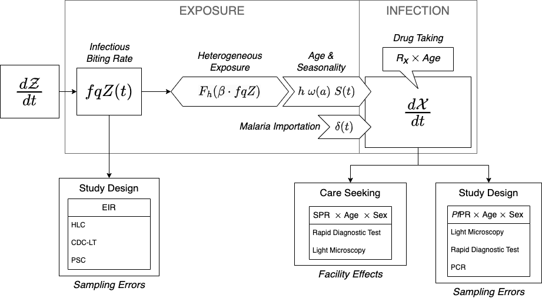

# Measuring Malaria for Control  

In [Malaria Metrics], we introduced the basic research and surveillance metrics that are commonly used.   

If we want to use evidence to make policy, we need to understand transmission and disease in its local context, which we learn about from assembling and analyzing the evidence. In malaria, the evidence is usually one or more of a core set of metrics. One useful metric is the *Pf*PR from cross sectional surveys; these are available from research studies, but they are also available from demographic health surveys (DHS) or malaria indicator surveys (MIS). If we are lucky, we will also have mosquito catch counts data (by some method), which we scale by effort and report as something like the *Pf*HBR. We estimate the *Pf*SR from some of these caught mosquitoes, and we take their product, the *Pf*EIR. From other designs, we might have estimtes of the *Pf*FoI, or if serology was done, we might know the *Pf*SCR. 

From routine clinical surveillance, we could get case counts or the *Pf*SPR. We can learn more if we stratify by age, or if we follow populations over time.

If we are to make sense of malaria as a changing baseline that has been modified by control, then we must know something about how transmission has been modified by control. First and foremost, we must understand anti-malarial drug taking, including the frequency of drug taking (for any purpose), adherence to prescribed regimens, and drug taking by severity. To understand transmission, we must have data describing intervention coverage and its timing. This would include patterns of bed net ownership and use over time, IRS and its coverage. We can't make sense of vector control coverage data without knowing something about the patterns of insecticide resistance.  We discuss [Measuring Vector Control] in the next chapter. 

For planning, we would like to know the burden of malaria, and we would like to have an estimate of transmission -- something like a malaria reproductive number.  

In most places, we will have routine surveillance data. We would like to piece together a coherent and accurate picture of transmission from this and from any other data we may have. To do so, we would like to know how these statistics compare in settings where two or more of them have been measured at the same place and at the same time. From studies like this, we can start to understand the **scaling relationships** among metrics, and the factors that influence them. What we have learned from studying these relationships is that there the relationship are highly non-linear [@HaySI2008MeasuringMalaria], and that some of the factors affecting this relationship are context dependent. We have already mentioned drug taking, and we must acknowledge the difficulty of estimating drug taking by age, in part, because it is often highly heterogeneous in populations. Other factors that have been implicated are heterogeneous biting, environmental heterogeneity, seasonality, travel and mobility. 

Sitting between us and the truth is an observational process, and we must attempt to quantify bias and error in this sampling process if we are to have any hope of getting an accurate picture of transmission in context. 

To get there, we need to organize our algorithms: 

+ The *Pf*PR varies in a population by age, sex, and the diagnostic method; so we simulate malaria in cohorts as they age, and we output the predicted *Pf*PR by age, sex, and diagnostic method. 

+ The *Pf*PR is modified by drug-taking; the effect modification varies in a population by age, access to care, and adherence to drug regimens. In our algorithms, we must consider various patterns of drug taking and chemoprotection. 

+ Exposure is *seasonal* 

    - seasonality *would* affect the true *Pf*PR and the true *Pf*EIR over time; 
    
    - seasonality *could* be a source of error in the estimated *Pf*PR (especially with respect to age) and estimated *Pf*EIR, particularly if the *Pf*PR is reported in young children, and mismatched even slightly with *Pf*EIR. 

+ Heterogeneous exposure:

    - exposure varies by age; 
    
    - there are other identifiable sources of frailty that we can deal with through stratification (*e.g.* house type, location, bed net use), and there are many frailties we will not be able to identify; 
    
    - the relationship between exposure and infection is affected by *environmental heterogeneity;* because of variability in mosquito populations at a fine spatial grain over time and space, and the trajectories of individual humans who are put at risk,  
    
+ The *Pf*EIR near home is obscured by human mobility through time at risk and exposure away from home; 

+ Travel and imported malaria can increase the *Pf*PR, even if there is no local exposure.  

+ Measurement errors in the *Pf*EIR 

    - There are *house effects* that bias the estimation of the *Pf*EIR 
    
    - Different methods of catching mosquitoes give different estimates for the HBR.  

These effects are incorporated into the framework. Frailties are dealt with by stratifying by age ($\omega(a)$) and other traits and assigning *biting weights*; when combined with mobility, these become part of the mixing matrix, $\beta$. Environmental heterogeneity modifies the relationship between the *Pf*EIR by stratum and the *Pf*FoI (through $F_h$). Seasonality in mosquito density ($Z(t)$) translates into seasonality in exposure ($S(t)$). Drug taking and immunity modify the *Pf*PR after exposure. 

We would like to understand mosquito populations, but we will rely on whatever data we have to *estimate* the *Pf*EIR (see Figure 4.1). This is a core algorithm for simulation-based analytics, and the framework was designed to serve these ends.  

In the following sections, we use the framework to illustrate the effects and effect sizes of these factors. The task of estimating is for another book, **Robust Analytics for Malaria Policy.** In this study, we make full use of modularity. We start by *stratifying* our human population by age, and possibly by other factors. We write algorithms that pass the density of blood feeding mosquitoes in a place, and our algorithms predict mosquito catch counts, depending on the method. From this, we compute the total FoI, which includes the *local* FoI (at and around home), and the *travel* FoI. These exposure rates, and algorithms describing drug taking, are translated into estimates of the true *Pf*PR. The models output the predicted *Pf*PR by age, sex, and method; and we also output the predicted patterns of care seeking and associated metrics at health facilities in an HMIS, by age and sex.

*** 

## Realistic Bounds 

An important reality check is that we can set sensible expectations about upper bounds on the *Pf*PR in relation to exposure. The maximum value of the *Pf*PR will tend to be observed in untreated populations with homogeneous exposure. To identify these bounds, we assume that we are passing the *true* *Pf*EIR, but not necessarily the *local* *Pf*EIR. 

## The Local Fraction 

### Travel 

### Mobility 

## Drug Taking 

## Seasonality 

## Frailty

At low intensity, frailty can affect the prevalence 

## Environmental Heterogeneity  

## *Pf*EIR *vs.* *Pf*PR in Data 

## *Pf*EIR *vs.* *Pf*FoI in Data 

## Synthesis 

