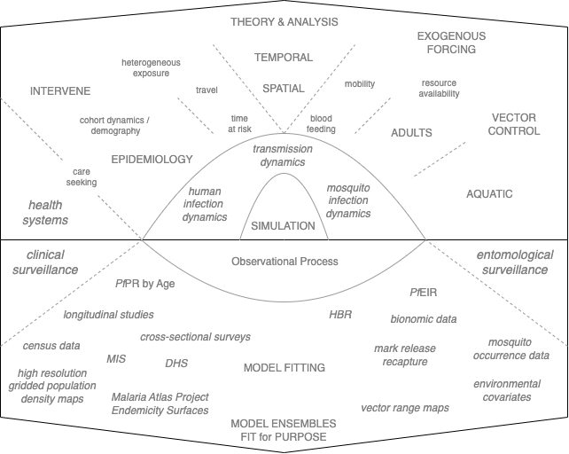

```{r include=FALSE}
knitr::write_bib(c("knitr", "book"), "", width = 60)

# automatically create a bib database for R packages
knitr::write_bib(c(
  .packages(), 'bookdown', 'knitr', 'rmarkdown'
), 'packages.bib')

knitr::opts_chunk$set(echo = FALSE, fig.path = "figs/")

```


# Foreword {-}

A large fraction of my time over the past 25 years has been devoted to learning about malaria and mathematical models of malaria epidemiology, transmission dynamics, mosquito ecology, malaria control, and the evolution of drug and insecticide resistance.
While I was building and analyzing models, I was looking for a way of organizing, synthesizing, operationalizing, and applying the rich body of theory developed over more than a century of malaria research.

Malaria was a name for a disease associated with recurring fevers. Starting around 1660, malaria was treated with a tea made from the bark of the Cinchona tree. 
In 1824, the drug quinine was isolated and used to treat malaria.
Later in the 19th century, Charles Laveran and Ronald Ross identified the cause of malaria and its mode of transmission 
[@RossR1911Book;@SmithDL2012_RossMacdonald]. 

In the 1900s, Ross developed the first mathematical models of malaria transmission to help with planning for the prevention of malaria. 
In the early 1950s, George Macdonald's updated Ross's mathematical theory and published a quantitative synthesis of malaria epidemiology and control.
Some of the weaknesses of Macdonald's model were exposed in field trials in the late 1960s. Many of these were addressed when Klaus Dietz and his colleagues published a new malaria model, in the 1970s, that was field tested in The Garki Project.
In the 1980s, Dietz developed models describing seasonality, treatment with anti-malarial drugs, and heterogeneous transmission.
Mathematical models of malaria and other infectious diseases were taken up by departments of ecology, leading to new and innovative approaches [@ReinerRC2013SystematicReview].
In the 1990s, within-host malaria models were developed [@MolineauxL1999ReviewIntrahost]. 
The mathematical theory developed for malaria epidemiology and transmission dynamics was incorporated into comprehensive individual-based malaria models (IBMs) developed at the Swiss Tropical Public Health Institute (2006), Imperial College (2010), and the Institute for Disease Modeling (2013). 

IBMs had solved one of the core challenges of using models for malaria policy -- a practical way of dealing with the complexity of malaria. While these IBMs represented an important advance, I had some lingering questions about the relationship between exposure, immunity, age, and disease; the spatial scales that characterized malaria transmission [@SmithDL2014Recasting]; and the stability of malaria elimination [@SmithDL2013StickySituation;@ChiyakaC2013Sticky]. I started developing my own framework for individual-based simulation. Sean L. Wu and I developed an IBM, called MBITES, that could simulate adult mosquito ecology and behavior in exquisite detail [@WuSL2020MBITES]. As we attempted to connect MBITES to models of human infection and immunity, I confronted the heavy computational load associated with using MBITES to simulate mosquito blood feeding at an individual level. 

I was looking for a way of translating evidence into policy that was powerful enough to handle the complexity of malaria and yet deal with the uncertainty. I was also hoping to identify a way of taming the complexity through identification of relevant detail [@LevinS1991RelevantDetail]. Despite the advantages of IBMs, I realized they might not be the tool I was looking for. 
I shifted gears and started working towards a mathematical and computational framework that was *not* an individual-based simulation model [@ReinerRC2013SystematicReview;@SmithNR2018AgentbasedModels].

I wanted a way of building models to support ***adaptive malaria control.*** 
Since malaria is so complex and locally peculiar, a core part of adaptive malaria control is using mathematical models for simulation-based analytics through iterative policy engagement. 
Over time, malaria programs *adapt* by identifying key knowledge gaps and modifying surveillance, monitoring and evaluation activities to fill those gaps. 
We wanted to give advice that was robust to uncertainty; analytics are robust if they characterize, quantify, and propagate uncertainty. 
We needed a mathematical framework for model building that was up to the task of analyzing malaria transmission dynamics and control *in situ,* all while quantifying and propagating uncertainty. 
Over time, we developed a bespoke inferential framework called ***robust analytics for malaria policy (RAMP):***

I thus thus set out to develop a nimble mathematical and computational framework for model building. To support RAMP and adaptive malaria control, the framework should be *extensible,* with a *plug-and-play * modular design; 
it should make it easy to swap out base models describing the core dynamics, and but it would also include flexibility in the choice of functional forms describing forcing and core processes.
To get malaria transmission right, we would need to be able to deal with heterogeneity of all sorts.
The framework should be structurally flexible, so that a model could incorporate space, time, and human population strata to deal with demography and population heterogeneity.
It should have scalability to handle realism and complexity: it should be possible to scale down spatial granularity for fine-grained spatial simulations [@CarterR2002SpatialSimulation;@GuW2003IndividualbasedModel;@PerkinsTA2013HeterogeneityMixing], to scale down temporally for fine-grained temporal simulations [@WuSL2020MBITES], or to scale up to understand or analyze regional processes and the emerging patterns [@TatemAJ2010InternationalPopulation].
To serve the needs of malaria programs, a framework would need  built-in support for exogenous forcing by weather and vector control to model malaria as a changing baseline modified by control. 
To get integrated vector control right, we went all-in with an individual-based simulation model for mosquito ecology and behavior (called MBITES) that could handle exquisite biological detail [@WuSL2020MBITES]. 
MBITES was inspirational but impractical, so we revisited models to incorporate new ideas about mosquito search and behaviors.
To serve programmatic needs, we developed algorithms and theory with skill sets that included the durability of interventions -- the waning potency of insecticides or decaying coverage --
and the net effect of one unit of vector control in relation to transmission intensity and coverage.
To make all the pieces fit together, we needed interfaces that could connect up models in a generic way; in the design phase, we worked with two model families for each major dynamical component -- one that was dead simple, and one that had a was highly realistic.
In some cases, the interface designs called for development of new algorithms: blood feeding, egg laying, environmental heterogeneity, human mobility, and mosquito dispersal. 
In making a master list to test the framework's extensibility, we found that some odd cases that needed to pass information among components -- endectocides and auto-disseminated larvicides -- but it was easy enough to accommodate these.
Beyond the algorithms, these models needed the support of mathematical theory.
We wanted to understand thresholds so we wrote the routines that would compute thresholds for malaria transmission in heterogeneous systems, when appropriate. 

Sometime in the fall of 2022, the last few pieces came together. In collaboration with Uganda's National Malaria Control Division (NMCD) and the Bioko Island Malaria Elimination Program (BIMEP), we have now developed a malaria policy framework that we call ***adaptive malaria control.*** We published the first versions of [MicroMoB](https://cran.r-project.org/package=MicroMoB) and [exDE](https://CRAN.R-project.org/package=exDE) at CRAN. 
We submitted a paper to PLoS Computational Biology [@WuSL2023SpatialDynamics]. A second paper forced us to confront a set of software design questions in relation to exogenous forcing [Add the citation here when it is published]. Meanwhile, we decided to rebrand exDE as [**ramp.xde**](https://dd-harp.github.io/ramp.xde/) for (ordinary and delay differential equations). We redesigned MicroMoB to catch up to ramp.xde, and rebranded it as [**ramp.dts**](https://dd-harp.github.io/ramp.dts/) (for discrete time systems).

After all that, it was time to write this book. 

<!-- In adaptive malaria control, we assume that policy needs mathematical models and concepts, but ideally, the mathematics would serve a role without drawing unnecessary attention. -->
<!-- Malaria policy discussions must focus on the issues at hand, including the concepts and evidence, not on the mathematics *per se*. -->
<!-- Ideally, mathematical ideas should convey rigor in understanding the summary statistics that appear in reports, and they should help structure policy discussions without becoming the focus of attention, except perhaps when the mathematics draws attention to something that needs to be clarified. -->
<!-- Ideally, the framework could be taken up and used by teams of local experts working in their own countries to reduce the burden of malaria and plan for its elimination.  -->
<!-- The framework would thus need to be flexible enough to support programmatic activites. -->
<!-- The same framework could also support academic activities taken up on the side. -->

***

This book was written as a primer for anyone who wants to build and analyze mathematical models of malaria. 
In the chapters on [Basic Malaria Models] and [The Ross-Macdonald Model], we write code in the text. The book is freely available, and it is possible to download the markdown files from github and use the code in RStudio.
After the first few chapters, the examples in the book use **ramp.xde** and **ramp.dts,** two software packages written for R that are designed for scalable and nimble model building. 
We use the software because it lowers the costs of building and implementing models that are up to the task of guiding malaria policy.
An advantage of using this framework and accompanying software is that it has solved the technical problems that often arise when building models that combine many factors.
These sorts of pitfalls are inevitable and annoying, and they are usually discovered the hard way.
We found design solutions that would help others building models to avoid these sorts of problems.
The framework and software took longer to develop than expected, in part, because there were more pitfalls than we had anticipated, and because we found most of them the hard way. 
For those who are not interested in using the software, the book covers most of the mathematical models and theory developed for malaria over the past century.

This book has been written to introduce the major concepts in the mathematical study of malaria transmission dynamics and control using the core features of the mathematical framework and the software (see Figure 1.1). Behind the scenes, the work was being done in a private githubr repository, the RAMP-Model-Library, which was set up during the primary design phase. The RAMP-Model-Library is where we made all our design mistakes: was the software truly plug-and-play, and was the framework truly extensible? As the primary design phase came to a close, the library that was once the laboratory became a classroom and a museum. Over time elements of library are being transformed into vignettes, the models are being added to publicly available code, and the ideas are being published in papers. The whole project is a resource for any developer who wants to add new base models or functionality. Most of all, all this is being set up for the end user, someone in a malaria program or working with a malaria program who wants to use simulation based analytics to analyze policies. This book is structured into a set of lessons that teach concepts. Some of the concepts build on one another, and others take on new challenges. We combine these lessons into some examples where we show some algorithms to build models fit for purpose. When a topic deserves a deeper dive, we have supplemented this book with vignettes or lessons.  

***
<center> 

{width=80%}

</center> 
*** 

This book shows, through examples, how to use the software to build malaria models.
Even without the software, it fills a gap for students who have taken an introduction to mathematical epidemiology or infectious disease modeling and want to go on in malaria. 
What are all the special topics that would need to be covered to build models that could be needed in malaria? 
This book *could* be the basis for such a course, if there were ever enough students.
Since there will probably never be enough graduate students at my university who are interested in applied malaria dynamics, the material is being developed for any student anywhere.
I will also be writing and recording some short lectures on a subset of topics.


The premise of this book is thus that the reader has started with a solid background in infectious disease models and malaria. We assume they've seen the Ross-Macdonald model before, that they've taken a class in mathematical epidemiology, and that they know something about how to construct and analyze models. This book emphasizes concepts and teaches through examples. We have left out a lot of the technical and mathemtical details, but we have written some vignettes and lessons to supplement the book. Most of this is found in the documentation for **ramp.xde** or **ramp.dts** or one of the supporting libraries.  
<!-- or it can be found in the [`RAMP-Model-Library`](../../RAMP-Model-Library/RAMP-Model-Library.html).  -->

While this book should help others build models for malaria policy, but it stops short of applying models to policy. That is covered in another book, [**_Robust Analytics for Malaria Policy_.**](../../RAMP-Book/_book/index.html){target="_blank"} 

***

In doing all this, we are building on an enormous body of work that started with Ronald Ross. While Ross is better known for identifying malaria parasites in a mosquito gut, which proved that malaria is mosquito transmitted, we are more interested in the rest of his career. 

After winning the Nobel Prize in 1902, Ross was instrumental in building solid quantitative foundations for malaria transmission and its measurement. Ronald Ross wrote the first models describing malaria transmission. In his writings from 1899 to 1911, it's clear that he was searching for quantitative way of saying something simple -- if there are not enough mosquitoes, the malaria transmission can't be sustained. There must be a critical mosquito density, above the cutoff malaria transmission would be sustained, and below it malaria would be eliminated. Ross was looking for a formula that encapsulated his intuition: how were thresholds related to the fact that it took two bites for a mosquito to complete its life cycle? Eventually, Ross wrote down some systems of equations that would describe malaria. The ideas, mathematics, and identification of parameters and processes were extended by other scientists later, most notably Alfred Lotka and George Macdonald. 

It seems that the challenge of malaria control was what pushed Ross toward modeling. Ross's first model was a discussion of adult mosquito movement to guide larval source management [@RossR1905LogicalBasis]. The first model describing malaria transmission appeared in a book, *The Prevention of Malaria in Mauritius* [@RossR1908]. When it came to thinking through control, Ross found it useful to do the math. More than a century later, this book is a look at what his vision has become.  

--David L. Smith

## Contributors {-}

I've done the primary writing for this book. The framework would not exist without the work of Sean L Wu and a few others. The book borrows from the work of others, and we have done our best to give credit through citations. It has been a collaborative process (see [Contributors]). The errors, however, are mostly mine. If you find mistakes or have questions, please drop me a note by email: [smitdave@gmail.com](mailto:smitdave@gmail.com). 

This is a work in progress, so the list of contributors will change over time. 

The software package `MicroMoB` was written by Sean L Wu, Sophie Liebkind, and David L Smith. The software package `exDE` was written by Sean L Wu and David L Smith. 

Most of the content so far was written by David L Smith. Contributors from the RAMP Team include: 

...please consult Dave if you would like a writing role. 
